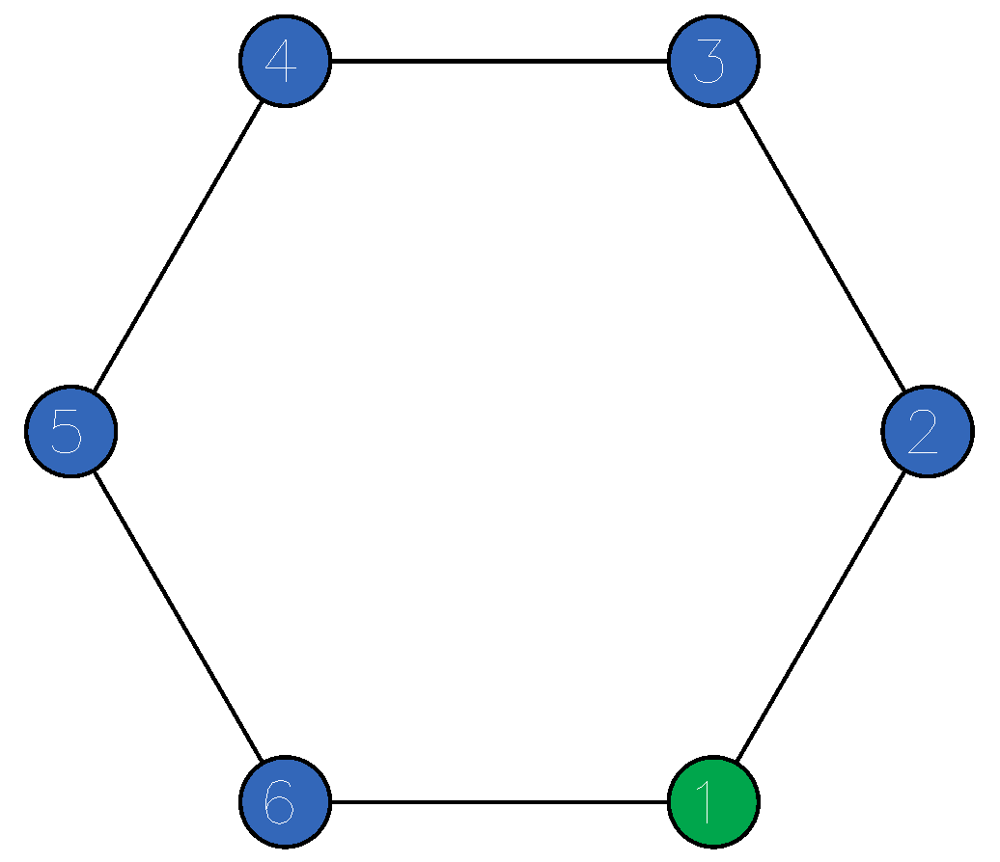

# worldturtle-decimate

An example worldturtle used to show how a the carnage maximum problem can be 
visualized using monads.

To execute this program:

```bash
- Run `cabal update`
- Run `cabal install --only-dependencies`
- Run `cabal build`
- Run `cabal exec worldturtle-decimate`
```


